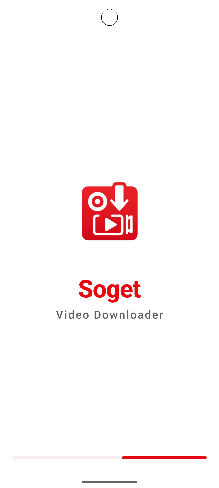
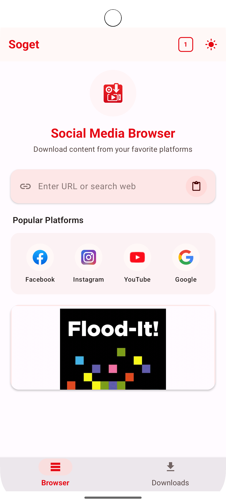
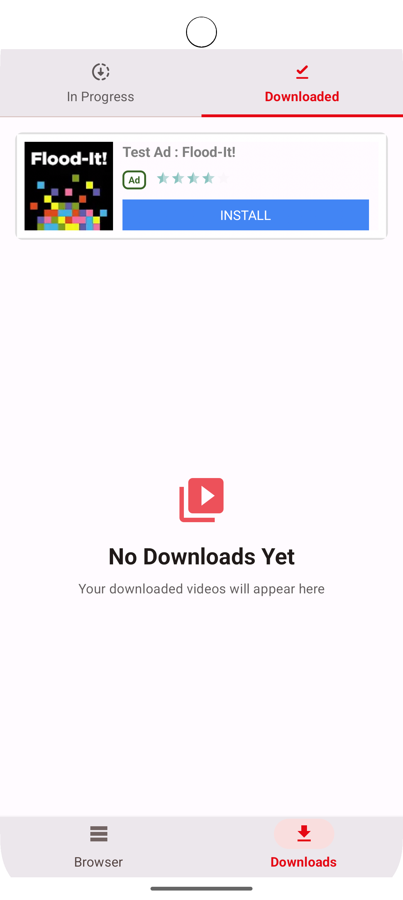

# Soget - Social Media Content Downloader

A modern Android application built with Jetpack Compose that allows users to download and save social media content.


## Screenshots






## Features

- Download videos from various social media platforms
- Built-in browser for easy content navigation
- Media viewer for downloaded content
- Dark and light theme support
- User-friendly interface with modern Material 3 design

## Technology Stack

### Core Technologies
- **Kotlin** - Primary programming language
- **Jetpack Compose** - Modern UI toolkit for native Android UI
- **Material 3** - Design system with latest UI components
- **Decompose** - Navigation and component-based architecture

### Key Libraries and Dependencies
- **Ktor** - For network requests and API communication
- **Coil** - Image and video loading library
- **Kotlinx Serialization** - JSON parsing
- **Firebase** - Analytics, Crashlytics, and Remote Config
- **AdMob & Facebook SDK** - For monetization

### Architecture
- Modern MVVM architecture pattern
- Component-based UI with Decompose
- Storage handling via Android's Environment APIs


## Development Setup
1. Clone the repository
2. Open the project in Android Studio
3. Sync Gradle files
4. Run the app on an emulator or physical device

## Build Instructions
```
./gradlew assembleDebug
```

## Requirements
- Android SDK 24 or higher
- Kotlin 1.9+
- Android Studio Arctic Fox or newer 